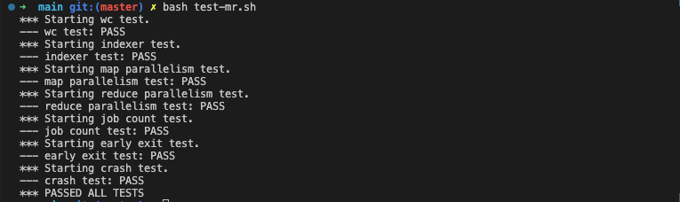
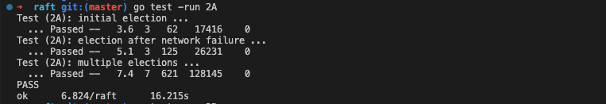
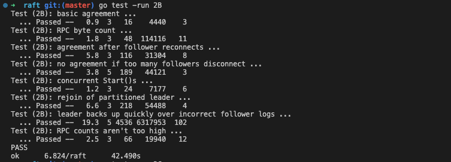
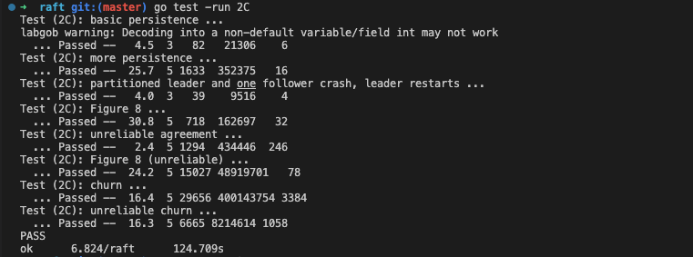
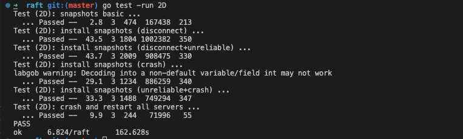
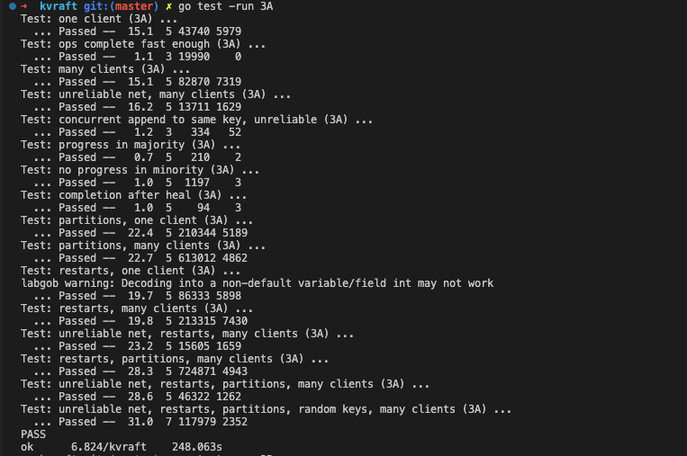
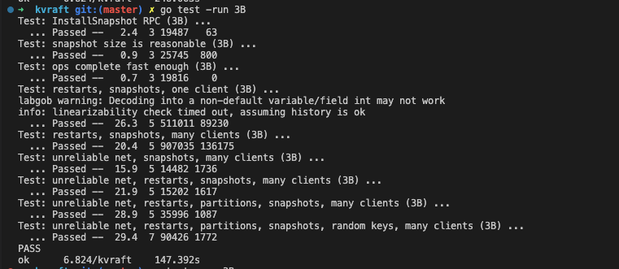

### Lab 1: MapReduce
Link: https://pdos.csail.mit.edu/6.824/labs/lab-mr.html

Paper: https://pdos.csail.mit.edu/6.824/papers/mapreduce.pdf

✅ 1. MapReduce

### Lab 2: Raft
Link: https://pdos.csail.mit.edu/6.824/labs/lab-raft.html

Paper: https://pdos.csail.mit.edu/6.824/papers/raft-extended.pdf

✅ 2A: Leader election

✅ 2B: Log

✅ 2C: Persistance

✅ 2D: Log compaction

### Lab 3: KV Raft
Link: https://pdos.csail.mit.edu/6.824/labs/lab-kvraft.html

Paper: https://pdos.csail.mit.edu/6.824/papers/raft-extended.pdf (section 8)

✅ 3A: Key/value service without snapshots

[X] 3B: Key/value service with snapshots (unreliable, need some work)

### Other relevant papers:
- https://static.usenix.org/event/nsdi11/tech/full_papers/Bolosky.pdf
- https://pdos.csail.mit.edu/6.824/papers/zookeeper.pdf